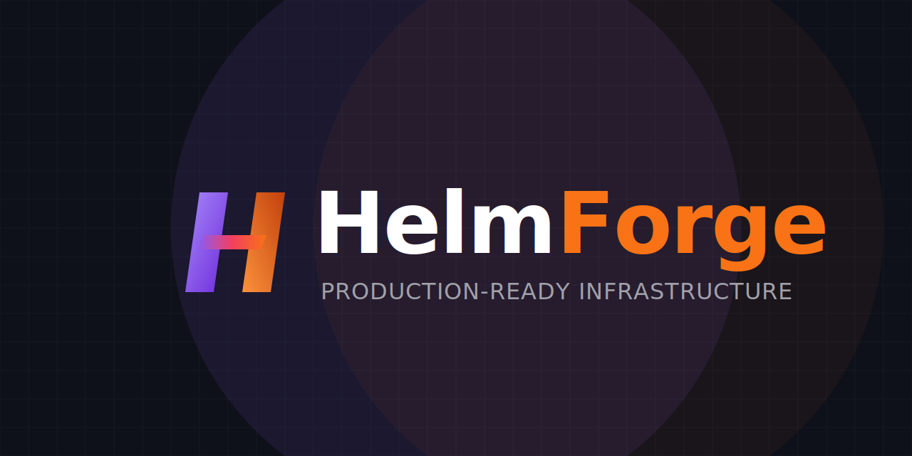

<div align="center">
  

  <p><h3>Production-ready Helm charts for Kubernetes</h3></p>
  
  <p>
    The ultimate open-source alternative to Bitnami. We package popular applications with sane defaults for security, built-in backups, and day-two operations. No proprietary layers. No limits.
  </p>

  <p>
    <a href="https://helmforge.dev"><b>Website</b></a> •
    <a href="https://helmforge.dev/docs"><b>Documentation</b></a> •
    <a href="https://github.com/helmforgedev/charts"><b>Helm Charts Repository</b></a>
  </p>

  <p>
    <a href="https://github.com/helmforgedev/site/actions/workflows/ci.yml"></a>
    <a href="https://github.com/helmforgedev/site/actions/workflows/deploy.yml"></a>
    <a href="https://opensource.org/licenses/MIT"></a>
    <a href="CONTRIBUTING.md"></a>
  </p>


</div>

---

## 🚀 Overview

This repository contains the source code for the **HelmForge** web portal and documentation engine ([helmforge.dev](https://helmforge.dev)). 

HelmForge is designed to fill the void left by commercialized chart ecosystems. It provides 100% open-source, OCI-compliant, and production-hardened Kubernetes Helm Charts, directly utilizing upstream images without proprietary vendor lock-in.

This frontend is built for extreme performance, rich aesthetics, and massive SEO discoverability.

## 🛠 Tech Stack

Our portal leverages a modern, static-first web architecture:

* **[Astro 6](https://astro.build/)** - Ultra-fast static site generator with zero JS by default.
* **[Tailwind CSS v4](https://tailwindcss.com/)** - Next-generation utility-first styling with native CSS variables and Design Tokens.
* **[MDX](https://mdxjs.com/)** - Markdown for components, driving our entire documentation portal.
* **[Playwright](https://playwright.dev/)** - End-to-End browser automation and visual regression testing.
* **[Framer Motion / Vanilla Motion]** - Orchestrating smooth `Awwwards`-tier UI animations and typing effects.

## 💻 Local Development

To run the site locally, ensure you have **Node.js >= 22** installed.

```bash
# Install dependencies
npm install

# Start the dev server at localhost:4321
npm run dev

# Build the production bundle
npm run build

# Preview the built production site
npm run preview
```

## 🧪 Testing (E2E)

We use Playwright to ensure zero regressions on critical paths (Terminal animations, Splash Screens, and SEO JSON-LD injection).

```bash
# Run the E2E test suite
npx playwright test

# View test report
npx playwright show-report
```

## 🌐 Related Repositories

If you are looking for the actual Helm Charts and their CI/CD pipelines, please visit our infrastructure repository:

👉 **[github.com/helmforgedev/charts](https://github.com/helmforgedev/charts)**

## 📜 License

This project is licensed under the [MIT License](LICENSE).
